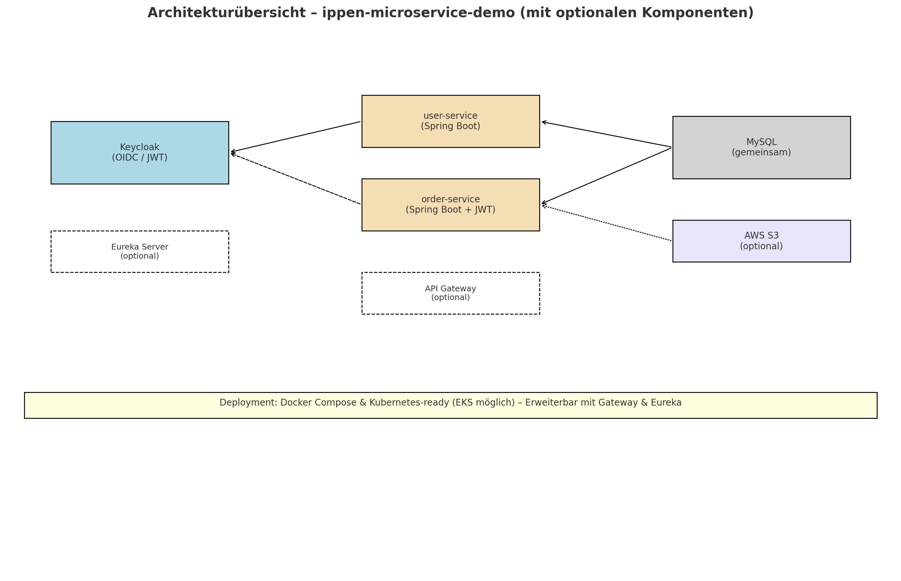

# 🧩 Ippen Microservice Demo

Diese Demo zeigt eine moderne Microservice-Architektur mit **Spring Boot**, **Keycloak**, **Docker**, **Kubernetes** und optionaler Anbindung an **AWS S3**. Sie wurde als technisches Showcase für das Interview bei **Ippen Digital** entwickelt – mit Fokus auf Authentifizierung, Service-Sicherheit und skalierbarer Architektur.

---

## 🎯 Relevanz für Ippen Digital & USER.ID

Dieses Projekt demonstriert essentielle Skills für die Position „Senior Java Backend Engineer“ bei Ippen Digital – speziell für die Weiterentwicklung der USER.ID-Plattform:

- **Microservice-Architektur** mit Spring Boot: Klare Trennung der Verantwortlichkeiten, RESTful APIs, Cloud-Readiness.
- **Moderne Authentifizierung**: OIDC & JWT mit Keycloak, Integration von OAuth2 Resource Server.
- **Kubernetes & AWS**: Containerisierung, K8s-Deployment-Files, vorbereitet für AWS (z.B. RDS, S3).
- **Security & Best Practices**: Geschützte Endpunkte, Unit- und Integrationstests, DevOps-Workflows.
- **Automatisierte API-Dokumentation**: OpenAPI/Swagger-UI für beide Services.

---

## ⚙️ Architekturüberblick



> Visualisiert sind: Authentifizierung via Keycloak, getrennte Microservices mit DB-Anbindung und geschütztem Zugriff über JWT-Token.

---

## 📦 Services

| Service         | Port | Beschreibung                            |
|-----------------|------|------------------------------------------|
| `keycloak`      | 8080 | Authentifizierungsserver (OIDC, OAuth2) |
| `user-service`  | 8081 | Benutzerverwaltung                      |
| `order-service` | 8082 | Bestellungen mit OAuth2/JWT-Schutz      |
| `mysql`         | 3306 | Datenbank für User & Orders             |

---

## 🚀 Starten mit Docker Compose

```bash
docker compose up --build
```

> Danach erreichbar:

* 🔐 [Keycloak Admin](http://localhost:8080) (`admin` / `admin`)
* 👤 User-Service: [http://localhost:8081](http://localhost:8081)
* 📦 Order-Service: [http://localhost:8082](http://localhost:8082)

Test-User: `alice` / `alicepass` wird automatisch importiert.

---

## 📖 API-Dokumentation (Swagger/OpenAPI)

Jeder Microservice bietet eine automatisch generierte OpenAPI-Dokumentation:
- [User-Service Swagger UI](http://localhost:8081/swagger-ui.html)
- [Order-Service Swagger UI](http://localhost:8082/swagger-ui.html)

Die Doku zeigt alle Endpunkte, Request-/Response-Modelle und erlaubt Test-Calls direkt im Browser.

---

## ☁️ Kubernetes Deployment (Minikube oder EKS)

```bash
kubectl apply -f deploy/k8s/
```

**Bereitgestellt werden:**

* Deployments & Services für `mysql`, `keycloak`, `user-service`, `order-service`
* Persistente Volumes via PVC
* Skalierbarkeit durch Replikation
* Secrets und Konfiguration können im Produktivbetrieb über K8s-Secrets und ConfigMaps erfolgen

---

## 🔐 Authentifizierung (Keycloak & JWT)

* Realm: `myrealm`
* Zugriff auf geschützte Endpunkte im `order-service` nur mit gültigem JWT-Token
* Konfiguration über `spring-security-oauth2-resource-server`

---

## 🌐 Beispiel-API-Aufrufe

```http
# Token holen (Beispiel mit curl)
curl -X POST "http://localhost:8080/realms/myrealm/protocol/openid-connect/token" \
  -d "grant_type=password" -d "client_id=order-service" \
  -d "username=alice" -d "password=alicepass"

# Bestellungen abrufen
curl -H "Authorization: Bearer <JWT>" http://localhost:8082/orders

# Benutzer verwalten
curl http://localhost:8081/users
```

👉 Siehe `example-requests.http` für konkrete Beispiele (z. B. nutzbar mit IntelliJ HTTP Client oder VS Code).

---

## 🛠️ Technologien

* Java 17, Spring Boot 3
* Spring Security + OAuth2 Resource Server
* Keycloak 24
* Docker & Docker Compose
* Kubernetes (Minikube / EKS-ready)
* AWS SDK v2 (für S3 vorbereitet)
* GitHub Actions für CI/CD
* JUnit, Mockito, Spring Security Test
* **OpenAPI/Swagger** für API-Dokumentation

---

## 🔁 Build & CI/CD

```bash
# Lokales Docker-Build
docker build -t thanhtuanh/user-service:latest ./user-service
docker build -t thanhtuanh/order-service:latest ./order-service
docker push ...
```

✅ Automatisierter CI/CD-Workflow (`.github/workflows/ci.yml`) beinhaltet:

* Build & Unit-Test pro Service (`mvn verify`)
* Upload von Testberichten (`surefire-reports`) als Artefakte
* Push der Docker-Images zu Docker Hub
* Linting & Validierung der Kubernetes-Manifeste
* Tests werden bei jedem Push auf `main` oder Pull-Request ausgeführt

---

## ✅ Unit-Tests

* `OrderControllerTest.java`: GET `/orders` mit simuliertem JWT
* `UserControllerTest.java`: GET `/users` ohne Authentifizierung
* JUnit-basierte Tests mit `MockMvc` und `@WebMvcTest`
* Test-Reports über GitHub Actions verfügbar (Artifacts)

```bash
# Order-Service
cd order-service
mvn clean verify

# User-Service
cd user-service
mvn clean verify
```

---
## 📸 Beispiel: API-Test mit curl

Ein erfolgreicher API-Call auf den User-Service sieht so aus:

[➡️ PDF-Screenshot ansehen](./docs/curl-users.pdf)


---

## 📝 Hinweise & Best Practices

* Zugangsdaten und Secrets sollten im Produktivbetrieb als Kubernetes-Secrets verwaltet werden (siehe K8s-YAML-Kommentare).
* Health-Checks der Spring-Services sind standardmäßig via `/actuator/health` verfügbar.
* Die Beispiel-Datenbank und Test-User sind zu Demonstrationszwecken einfach gehalten.
* **Security-Fokus:** Authentifizierung per OIDC/JWT, Service-Trennung, Integrationstests mit Security-Kontext.

---

## 👤 Autor

[🔗 Duc Thanh Nguyen – GitHub Portfolio](https://github.com/thanhtuanh/bewerbung)

---

**Stand:** Juni 2025