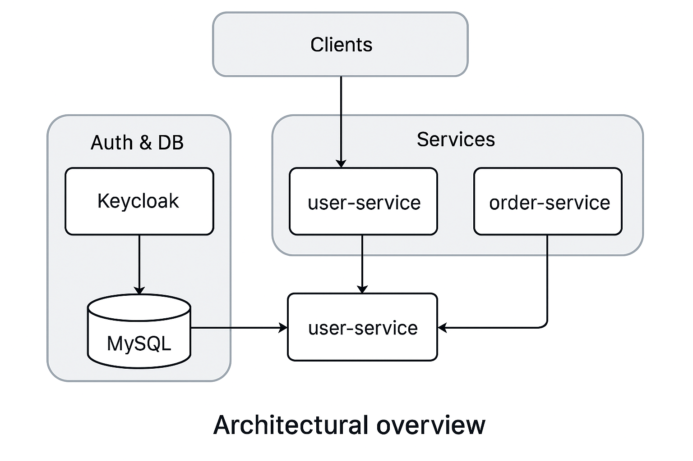

# 🧩 Ippen Microservice Demo

Diese Demo zeigt eine moderne Microservice-Architektur mit **Spring Boot**, **Keycloak**, **Docker**, **Kubernetes** und optionaler Anbindung an **AWS S3**. Sie wurde als technisches Showcase für das Interview bei **Ippen Digital** entwickelt – mit Fokus auf Authentifizierung, Service-Sicherheit und skalierbarer Architektur.

---

## ⚙️ Architekturüberblick


---

## 📦 Services

| Service         | Port | Beschreibung                            |
| --------------- | ---- | --------------------------------------- |
| `keycloak`      | 8080 | Authentifizierungsserver (OIDC, OAuth2) |
| `user-service`  | 8081 | Benutzerverwaltung                      |
| `order-service` | 8082 | Bestellungen mit OAuth2/JWT-Schutz      |
| `mysql`         | 3306 | Datenbank für User & Orders             |

---

## 🚀 Starten mit Docker Compose

```bash
docker compose up --build
```

Danach sind erreichbar:

* 🔐 [Keycloak Admin](http://localhost:8080) (admin / admin)
* 👤 `user-service`: [http://localhost:8081](http://localhost:8081)
* 📦 `order-service`: [http://localhost:8082](http://localhost:8082)

Test-User `alice` (Passwort: `alicepass`) wird beim ersten Start angelegt.

---

## ☁️ Kubernetes Deployment (für Minikube oder EKS)

```bash
kubectl apply -f deploy/k8s/
```

Die Ressourcen umfassen:

* Deployments & Services für: `mysql`, `keycloak`, `user-service`, `order-service`
* Persistenz via PVC
* Skalierung durch Replikate

---

## 🔐 Authentifizierung (Keycloak & JWT)

* Realm: `myrealm`
* Resource Server (`order-service`) nutzt Keycloak OIDC Token
* Schutz von Endpunkten über `spring-security-oauth2-resource-server`

---

## 🌐 Beispiel-APIs

```http
# Token holen
POST http://localhost:8080/realms/myrealm/protocol/openid-connect/token

# Orders abrufen (JWT erforderlich)
GET http://localhost:8082/orders

# User verwalten
GET http://localhost:8081/users
```

> Siehe `example-requests.http` für vollständige Beispiele (mit Token und Headern).

---

## 🛠️ Technologien

* Java 17, Spring Boot 3
* Spring Security (OAuth2 Resource Server)
* MySQL 8
* Docker / Docker Compose
* Kubernetes (k8s), Minikube
* AWS SDK v2 (S3-Integration vorbereitet)
* CI/CD: GitHub Actions

---

## 📦 Build & CI/CD

```bash
docker build -t thanhtuanh/user-service:latest ./user-service
docker build -t thanhtuanh/order-service:latest ./order-service
docker push ...
```

GitHub Actions: `.github/workflows/ci.yml`

---

## 👤 Autor

[🔗 Duc Thanh Nguyen – GitHub Portfolio](https://github.com/thanhtuanh/bewerbung)

---

**Stand:** Juni 2025

```

